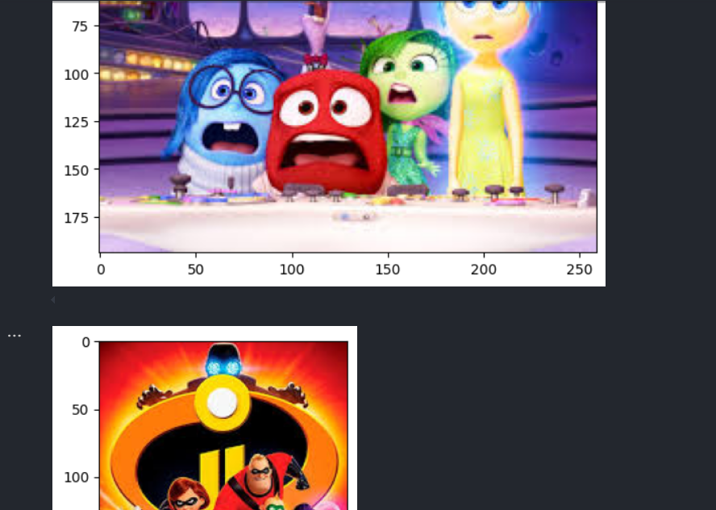
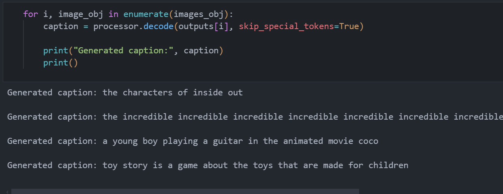
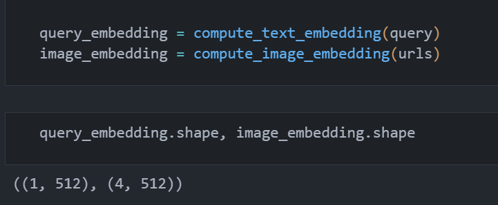
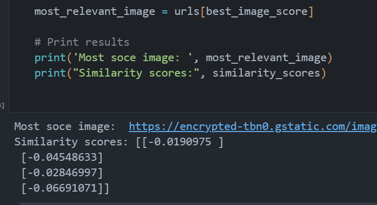

# Assignment 2 Report

## Approach

### Part 1: Generate Captions for Images
- I have used `blip-image-captioning` Model
- Used the BlipProcessor for precessing the data and BlipForConditionalGeneration for inference

### Part2: Build an Image Search Engine
- Model Used: blip-itm-base-coco
- Computed the embeddings for each the images, and the query
- Used cosine similarity to find the most similar images

## Challenges Faced and How I Overcame Them
- The main challenge was to find the right model for the task. I tried several models before settling on the final one.

## Screenshots of the Interface and Results

### Screenshots for the part 1

### Screenshots for the part 2

